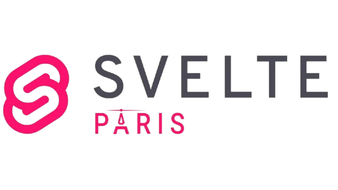

# Svelte Paris

## Introduction
🇫🇷
Svelte Paris est un groupe qui s'adresse à tous ceux qui souhaitent développer et partager leurs connaissances sur le framework Svelte. Le présent repository a pour objectif de centraliser les documents liées à l'organisation du groupe ainsi que de gérer la gouvernance et les différents projets.

🇬🇧
Svelte Paris is a group for anyone who wants to develop and share their knowledge about the Svelte framework. This repository aims to centralize documents related to the group’s organization, as well as manage governance and various projects.

## Links and contacts
- [Meetup](https://www.meetup.com/svelte-paris)
- [Github](https://github.com/svelte-paris)

## Brand

Raw sources [here](branding/)

- Logo SVG

- Logo PNG

- Logo full PNG

